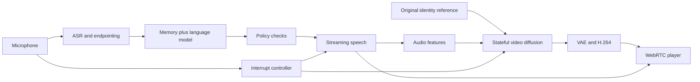

# Build the photorealistic call

## Exact model chain and where it runs

Default clean route below. All dollar amounts are marginal planning costs before the shared 25% contingency; compute allocation includes idle time. They exclude payment fees. None are measured latency results.

| Order / job | Exact model or component | Host and meter |
|---|---|---|
| 1. Original character image | `@cf/black-forest-labs/flux-2-klein-4b` | Workers AI. At $0.000287/output 512px tile, a 1024px square uses four output tiles: about $0.001148, plus input tiles where applicable. Generate curated assets once, inspect, reuse the identity reference. |
| 2. Hear and endpoint user speech | `@cf/deepgram/flux` | Workers AI streaming ASR; $0.0077 per input minute. Budget the whole open stream, including listening. |
| 3. Retrieve relationship context | D1, no embedding model | Up to eight user-approved facts plus recent turns within a 4,096-token prompt. No vector database needed for MVP. |
| 4. Plan and speak conversationally | `@cf/qwen/qwen3-30b-a3b-fp8` | Workers AI, $0.051/M input and $0.335/M output. Three turns/minute × 4,096 input tokens, 100 output tokens/minute: $0.000660/min. Use short, non-thinking responses and one stable character specification. |
| 5. Text policy check | `@cf/meta/llama-guard-3-8b` plus deterministic product rules | Workers AI, $0.484/M input and $0.030/M output. Three total checks/minute, each 1,024 input + 64 output: $0.001493/min. Additional checks must be metered. Guarding every separate clause can cost more. |
| 6. Synthesize speech | `@cf/deepgram/aura-2-en` | Workers AI, $0.030/1,000 characters; 450 characters/minute: $0.0135/min. Actual voices/streaming endpoint need integration testing. |
| 7. Extract audio conditioning | Quark route: bundled `wav2vec2-large-xlsr-53-english` in `Wan-AI/Wan2.2-S2V-14B` | Self-hosted GPU/CPU, included in allocated video node. This is audio-to-video conditioning, distinct from ASR. |
| 8. Encode scene/identity | Wan bundle's `models_t5_umt5-xxl-enc-bf16.pth`, tokenizer, reference image and rolling model state | Included in video node. Cache stable conditioning per session, not intimate conversations across accounts. |
| 9. Generate continuous frames | `Wan-AI/Wan2.2-S2V-14B` + `Quark-Vision/Live-Avatar` / `liveavatar.safetensors`, using LiveAvatar v1.1 code | Five-GPU TPP baseline; model the cost of eight rented H100s if the node cannot be split. $18.50 total node-hour / 60 / 50% utilization = $0.616667 per connected minute. |
| 10. Decode pixels | Bundled `Wan2.1_VAE.pth` | Included in video group, not a second API charge. Pin its exact revision along with the diffusion model. |
| 11. Deliver call | GPU/CPU H.264 encoder, Opus, timestamped RTP, Cloudflare Realtime SFU/TURN, browser WebRTC | At aggregate 2.128 Mbps SFU egress and $0.05/GB: $0.000798/min. Assume no free allowance in long-run unit costs; avoid double-charging the same SFU/TURN leg. |
| 12. Settle usage and memory | Account Durable Object + D1 | $0.001/min miscellaneous variable budget, plus monthly fixed budget in ECONOMICS. Commit only user-approved memory; no raw recording. |

[Cloudflare model prices](https://developers.cloudflare.com/workers-ai/platform/pricing/), [SFU pricing](https://developers.cloudflare.com/realtime/sfu/pricing/), [Wan bundle files](https://huggingface.co/Wan-AI/Wan2.2-S2V-14B/tree/main), [Quark repository](https://github.com/Alibaba-Quark/LiveAvatar). The clean voice/model/transport sum is $0.025151/min before contingency. With the eight-GPU renderer: $0.802272/min after contingency. No separate API token bill applies to self-hosted video models.

At these assumptions, 30 minutes consumes 368,640 LLM input tokens and 3,000 output tokens; 60 minutes consumes 737,280 and 6,000. Guard tokens are additional: 92,160/5,760 for 30 minutes, 184,320/11,520 for 60. An hour also budgets 27,000 synthesized characters. Token counts are driven by turns and repeated context, not simply elapsed time; do not let the entire hour's transcript grow into every prompt.

## Lower-cost and adult routes

**Pro challenger:** replace stages 7–10 with `Soul-AILab/SoulX-FlashHead-1_3B/Model_Pro`, its bundled `VAE_Wan`, and `facebook/wav2vec2-base-960h`. Two RTX 5090s and SageAttention are the publisher's real-time setup. Obtain an actual US node quote; $3 GPU + $0.30 extras/hour is a budget assumption. Keep one call per pair until profiled. Lite uses `Model_Lite` and `VAE_LTX` on one 4090; it is a quality comparison, not an automatic paid fallback. Code and model card label Apache-2.0, but preserve upstream VAE/audio encoder licenses in the deployment manifest. [Weights and subdirectories](https://huggingface.co/Soul-AILab/SoulX-FlashHead-1_3B/tree/main).

**Adult local conversation:** after provider/legal approval, replace hosted ASR, LLM and TTS with [Systran/faster-whisper-small](https://huggingface.co/Systran/faster-whisper-small) (MIT), [Qwen/Qwen3-8B](https://huggingface.co/Qwen/Qwen3-8B) (Apache-2.0, non-thinking), and [hexgrad/Kokoro-82M](https://huggingface.co/hexgrad/Kokoro-82M) (Apache-2.0, licensed preset voice). Add [Silero VAD](https://github.com/snakers4/silero-vad) (MIT) for endpointing. A separate local Qwen policy pass enforces the product rules; it is not a validated safety system merely because it runs locally. Test disallowed inputs and outputs before access. Do not send adult histories to a clean-only hosted guard.

Budget a separate $1.20/hour auxiliary worker at the same utilization and one call at a time; do not squeeze these models onto a saturated video GPU without measuring. With the eight-GPU video group, this models $0.8231/minute or $49.38/hour. With the Pro pair, it models $0.1897/minute or $11.38/hour. Image references remain preapproved originals; adult clip requests stay on the permitted self-hosted route. The free clean product does not require adult inference.

**Voice quality challenger only:** [Qwen/Qwen3-TTS-12Hz-1.7B-CustomVoice](https://huggingface.co/Qwen/Qwen3-TTS-12Hz-1.7B-CustomVoice). Better expression may justify more compute; published first-packet latency is not our full-call latency. Do not deploy Kokoro and Qwen TTS simultaneously by default. No XTTS-v2 commercial assumption or unlicensed fine-tune.

## How the live experience works

Keep the renderer warm during an admitted call. Generate small chronological blocks with fixed identity conditioning and bounded rolling state. Feed the next speech block as soon as it is approved; decode and transmit the previous block in parallel. During listening, generate new silent/listening frames and preserve scene continuity. Do not loop a canned idle clip. Whether each model produces convincing silent reactions is a specific test, not established behavior.

The integration idea is **a shared audio/video timeline with a short cancellable future buffer**. Speech, rendered frames and usage all carry session and turn IDs. If the user interrupts, stop old audio, invalidate unplayed old-turn frames, and resume generation from the last displayed state. Preserve identity anchors while discarding stale action intent. This is an engineering proposal using existing streaming techniques, not a claim of a newly invented algorithm. Quark/FlashHead do not provide this complete product controller out of the box.

Replace the FlashHead sample's complete-WAV input and multi-second MP4 delivery with an incremental PCM ring buffer and frame/RTP output. Extend the Pro distributed path separately; the public single-GPU demo cannot prove it. Bound audio lookahead and benchmark the latency/quality tradeoff rather than assume arbitrarily small blocks work. Never play speech significantly ahead of its face just to claim low latency.

Warm-call target: p95 user endpoint to matching audible/visible response ≤2 seconds; barge-in stops old playback ≤250ms; sustained ≥25fps at the declared native resolution; A/V skew ≤100ms. These are ambitious acceptance targets. First-frame renderer timings exclude ASR, language, TTS, chunk accumulation and network. Do not upscale a 512px result and advertise native 1080p. Show actual resolution in the technical benchmark.

Camera-like presence is the first scope. User camera remains off: the AI hears you but does not see you. If two-way vision is required later, add explicit camera consent, a locally permitted vision model, sampled-frame costs and deletion behavior; that is not included in current latency or pricing. Do not imply it already exists.

## Clips are a separate purchase

Use [Wan-AI/Wan2.2-TI2V-5B](https://huggingface.co/Wan-AI/Wan2.2-TI2V-5B) on a separate worker for a five-second cinematic clip, conditioned on the same original identity reference and bounded requested scene. Include its tokenizer/text encoder/VAE in the license manifest. It does not provide guaranteed synchronized speech; speaking clips should use the tested live renderer instead and be priced independently.

Flow: validate request → reserve one clip credit → enqueue → generate → inspect identity/content/technical validity → deliver private signed asset → settle once. Failure/cancellation restores credit; retries cost us. Planning assumption: $1.20 worker-hour, 120 allocated seconds per attempt, 80% success, $0.35 per-delivery other costs and 25% contingency = $0.50/delivered clip. Target p95 ready ≤120 seconds, not a promise. Cold loads, queueing, rejected outputs and idle allocation must fit the 120-second cost budget or trigger repricing. Clips never interrupt a live worker.

## Infrastructure, onboarding and billing

Cloudflare Workers serves the web/API; D1 stores account-owned records; one Durable Object per account serializes allowance reservations; private R2 stores original references and delivered clips. React/TypeScript web client and a Python Linux GPU service are proposed, not implemented. [Workers pricing](https://developers.cloudflare.com/workers/platform/pricing/), [Realtime](https://developers.cloudflare.com/realtime/sfu/).

**GPU procurement:** TensorDock is the selected candidate. Request an available US two-RTX-5090 node for Pro and an HGX H100 SXM 80GB node for Quark, fast peer interconnect, adequate CPU/RAM/encoder capacity, persistent encrypted storage, network suitability, full compute contract and intended-use approval. Do not assemble unrelated marketplace GPUs and assume they form an NVLink cluster. Their public starting H100 price is $2.25/card-hour; the 5090 budget is unquoted. If only an eight-card allocation is sold, pay for eight. US location, SLA, stock and adult permission remain unresolved. [Rates](https://www.tensordock.com/), [AUP](https://docs.tensordock.com/legal-information/acceptable-use-policy-aup).

Journey: AI disclosure and eligible region → account and applicable adult verification → choose one of three fictional adult characters/preset voices → free clean text and editable memory → clearly priced subscription/clip pack → hosted checkout → server-confirmed entitlement → microphone permission and device check → remaining time/service hours → warm-slot admission → live call → usage receipt and optional memory save. Non-explicit and adult content modes are separate; MVP accounts are 18+ even in clean mode, rather than introduce minors into an adult-capable service.

Reserve an allowance before admitting a call, settle connected healthy seconds once, include listening, pause pilot deductions during degradation/reconnect, and release unused reservations on expiry or crash. One active call per account. Stop at zero without automatic purchase. Use an idempotent server ledger for renewals/refunds/chargebacks; never trust a checkout redirect. Captions, keyboard access, mute/end, deletion and clear cancellation are MVP requirements.

[.env.example](../.env.example) contains planned settings and empty secrets. Runtime Cloudflare bindings are `AI`, `DB`, `ASSETS_BUCKET`, `ACCOUNT_SESSION`; bindings are not string API keys. GPU provisioning stays manual, so no cloud management key is required by the runtime. Credentials never enter the browser. No integration presently reads these settings.

## Prove it before selling it

1. **Visual and streaming proof:** reproduce released defaults; pin hashes/licenses; test 30 and 60 continuous minutes with silence, interruptions, laughter and head turns. Record native resolution, fps, latency, identity drift, buffering and memory growth. Founder judges whether it looks filmed rather than animated. Engineer owns this before implementing paid access.
2. **Cost proof:** profile one call and a second attempted admission, measured provider charges and idle hours. Scheduled beta slots avoid a permanently idle fleet. Stop any route that cannot meet both the visual bar and a viable price. No assumed shared-GPU savings.
3. **Product proof:** ten eligible testers after host/state approval; compare repeat usage and real willingness to pay at the actual price. Target ≥50% recurring contribution using actual fees; free-user subsidy, acquisition and legal costs are separate.
4. **Release checks:** independent billing/tenancy/security review and staging evidence before paid launch. Test forged age/payment results, duplicate/out-of-order events, empty audio, network loss, GPU crash, cancellation, depleted allowance, content-routing failure and recovery. Log timings/tokens/charges, not intimate content.

Offline checks: `python scripts/economics.py --json`, `python -m unittest discover -s tests -v`, `python -m compileall -q scripts tests`, `git diff --check`. These validate the planning calculator, not video feasibility. No live inference, staging or production system exists yet.
