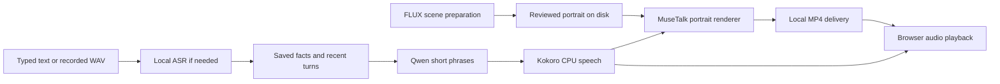

# Running local prototype on a 16GB GPU

Updated September 8, 2026. **A non-explicit, single-user companion prototype now runs locally.** It supports typed messages, spoken replies, push-to-talk WAV input, editable persistent memory and short photorealistic lip-sync replies. All selected inference runs on the existing PC; no remote GPU, API keys or new hardware is required.

This is a useful local prototype, not full FaceTime: the portrait/background are prepared, mouth movement is generated, and the head/body remain still. The browser receives a completed video phrase before playing it. Automatic check-ins, arbitrary video/body generation, commercial adult capability, payments and public deployment remain unimplemented or unqualified.

## Run on this configured PC

Ollama must be running. From the repository root:

```powershell
./scripts/start_local.ps1
```

Open **http://127.0.0.1:8765** and wait for model warm-up. The server warms dialogue, CPU speech/ASR and one portrait reply before readiness. Ollama keeps the selected model resident for 30 minutes after use; a later reply may reload it. The final 9B app warmed in **21.50 seconds** on a measured restart; first startup can take minutes with cold Python/model caches; no cold-start SLA is established. A video startup error leaves text/voice available with an explicit notice. Stop the foreground server with Ctrl+C.

Choose Text, Voice or Video reply; type a message, or select Record message and then Send recording. Recordings are limited to about 30 seconds. Microphone permission is requested only on that action. Stop reply cancels pending work and playback. Play latest reply handles browser autoplay restrictions. Save lasting facts in Memory; Clear conversation & memory deletes saved conversation data and app-generated reply media, including replies from previous server sessions. Prepared scene images remain.

No `.env` file is needed or read by the local app. `.env.example` is a future deployment contract; its flags do not enforce production access controls. Local runtime choices are in `local_app/models.py`, and the server is hardcoded to loopback. Do not expose this service through a tunnel or public proxy.

## Installed model chain

| Work | Selected model / artifact | Execution |
|---|---|---|
| Dialogue | **Qwen3.5-9B**, Ollama `qwen3.5:9b-q4_K_M` | GPU, Q4_K_M, 4,096-token context, thinking disabled, temperature 0.5, presence penalty 0, short phrases |
| Speech recognition | **Systran/faster-whisper-base.en** | CPU int8, four threads, beam 1, VAD; English prototype |
| Speech output | **Kokoro-82M ONNX v1.0**, float32, voice `af_sarah` | CPU ONNX Runtime, four intra-op / one inter-op threads |
| Character / scene preparation | **black-forest-labs/FLUX.2-klein-4B** | Separate GPU process, bf16 with CPU offload, four steps, 512x640; exit before calls |
| Lip movement | **TMElyralab/MuseTalk 1.5** | GPU FP16, 256x256 face region, channels-last, batches of eight |
| Face latents / decoding | **stabilityai/sd-vae-ft-mse** | GPU FP16, used by MuseTalk |
| Audio features for lip-sync | **openai/whisper-tiny** encoder | GPU FP16; distinct from CPU speech recognition |
| Face localization | **OpenCV YuNet 2023mar ONNX** | CPU landmarks, reviewed crop and feathered mouth blend |
| Video delivery | Local **FFmpeg**, H.264/AAC in MP4 | CPU `libx264` on this driver; local HTTP byte ranges |

Sources: [Qwen tag](https://ollama.com/library/qwen3.5:9b-q4_K_M), [Qwen model card](https://huggingface.co/Qwen/Qwen3.5-9B), [faster-whisper](https://github.com/SYSTRAN/faster-whisper), [Kokoro runtime](https://github.com/thewh1teagle/kokoro-onnx), [Klein card](https://huggingface.co/black-forest-labs/FLUX.2-klein-4B), [MuseTalk](https://github.com/TMElyralab/MuseTalk), [VAE card](https://huggingface.co/stabilityai/sd-vae-ft-mse), [Whisper-tiny](https://huggingface.co/openai/whisper-tiny), [YuNet](https://github.com/opencv/opencv_zoo/tree/main/models/face_detection_yunet).

HF revisions and file lists are pinned in [local-models.json](../config/local-models.json); Kokoro/voice/YuNet URLs and SHA-256 are pinned in [local-assets.json](../config/local-assets.json). The downloader validates heavyweight HF files against the pinned revision's LFS hashes and writes a local manifest. Observed selected Ollama manifest digest: `6488c96fa5faab64bb65cbd30d4289e20e6130ef535a93ef9a49f42eda893ea7`. The tag is not immutable: compare the digest when reproducing; the app does not currently enforce it.

Qwen/Klein/Kokoro have Apache declarations; MuseTalk code is MIT and its authors permit commercial model use subject to separate dependencies. The SD VAE has its own OpenRAIL terms. No blanket commercial or adult clearance follows from this table. Preserve component, voice and asset terms; [USA](USA.md) tracks the deferred release questions. Adapter attribution and YuNet notices are under `local_app/licenses/`. An upstream MuseTalk human test image was used only for private noncommercial diagnostics; it is excluded from the app character, commits and any funding demo. Mira is an original locally generated fictional adult character.

## Logic and data flow



Scene generation is separate from the conversation: create a portrait/setting, review it, exit the image process, then warm the app. The app reuses the selected scene and face latents. A scene switch recomputes that face representation. It does not generate a hidden physical activity or pretend that prepared imagery is live footage.

Each conversation job supplies saved notes as user-provided data, separate from system instructions, plus four recent exchanges, asks Qwen for one natural sentence of at most 16 words, then generates audio/video for that phrase. The worker defensively caps output at two chunks if the model ignores the sentence instruction. The HTTP job exposes text early and media only after it exists. There can be a playback gap between chunks. A single inference job is allowed at once; concurrent submissions receive 409. Cancellation is checked between model stages and visual batches, so it is not instantaneous inside a running inference operation. Cancelled work cannot recreate cleared memory.

The character knows only what the user supplied. A manually edited 1,200-character memory and at most 50 exchanges persist in `generated/local-app/memory.sqlite3`; the browser restores 12 exchanges. No automatic long-term extraction, vector store, event scheduler or covert user profiling exists. Facts/corrections given only in chat can fall out of the four-turn context; edit Memory to retain them for later recall. Recorded microphone input stays in RAM; generated audio/video stays locally until reset or bounded cleanup. The latest 100 app reply files and 20 job records are retained at most. SQLite secure deletion is enabled, but reset is not a forensic disk-erasure guarantee. Data is not encrypted at rest by this app; use synthetic test profiles on a trusted machine.

HTTP boundaries include loopback binding, Host/Origin checks, a per-boot request token, no CORS, no-store responses, a restrictive content policy, request-size limits and fixed file routes. Camera access is disabled. These local controls are not multi-user authentication or production security. No service worker caches conversations, and no browser speech API sends audio to a cloud service.

## Hardware and reproducible setup

Verified: RTX 4060 Ti, 16,380 MiB VRAM; driver 595.97; approximately 47.7 GiB RAM; Windows; Ollama 0.33.3. The isolated `.venv` uses Python 3.12.14, PyTorch 2.11.0+cu128 and the versions in [requirements](../config/local-poc-requirements.txt). Existing 27B models were left unchanged. System RAM does not add to GPU VRAM.

For a fresh environment, install Python 3.12, Ollama and FFmpeg first. Then, using a Python 3.12 executable:

```powershell
python -m venv .venv
.\.venv\Scripts\python.exe -m pip install torch==2.11.0 torchvision==0.26.0 --index-url https://download.pytorch.org/whl/cu128
.\.venv\Scripts\python.exe -m pip install -r config/local-poc-requirements.txt
ollama pull qwen3.5:9b-q4_K_M
.\.venv\Scripts\python.exe scripts/download_local_models.py --assets-only
.\.venv\Scripts\python.exe scripts/download_local_models.py --models asr-base-en musetalk sd-vae whisper-tiny klein
```

Selected artifacts occupy about **25.11 GiB**, including Ollama weights, excluding Python/CUDA libraries, caches, rejected comparators and generated media. Allow extra installation/download headroom. Downloads require internet; inference subsequently uses local files and loopback Ollama. Models, the Python environment, download manifests and media are ignored by Git. No paid model account is necessary for this setup. Downloaded files are hash-checked; failed large transfers can resume in ranges. No external model service is called during conversation.

Prepare scenes with the server stopped and the selected dialogue model unloaded. Each invocation exits and releases its GPU allocation:

```powershell
ollama stop qwen3.5:9b-q4_K_M
.\.venv\Scripts\python.exe scripts/prepare_local_scene.py
.\.venv\Scripts\python.exe scripts/prepare_local_scene.py --scene garden
.\.venv\Scripts\python.exe scripts/prepare_local_scene.py --scene cafe
./scripts/start_local.ps1
```

Review each output under `generated/local-app/` before using it. A repeated seed/reference is not proof that identity or setting is correct. The generator does not run during an active call. The current FFmpeg requires a newer NVENC driver API than driver 595.97 provides; the renderer probes compatibility and successfully falls back to CPU H.264. This task did not alter the system driver.

## Measurements and limitations

Final selected **9B** app, warm synthetic HTTP trials:

| Trial | Samples | Result |
|---|---:|---|
| Typed input to first completed speech | 3 | **1.504–2.204 seconds** |
| Generated WAV question through ASR to first speech | 1 | **2.299 seconds**, including 0.753 seconds ASR |
| First completed video, living room / garden / cafe | 3 | **5.428 / 4.828 / 4.574 seconds** |
| GPU cancellation observed during rendering | 1 | **0.502 seconds**; memory unchanged and reply files removed |
| Media decode checks | 3 MP4 files | H.264/AAC decoded; both streams start at zero; video ends within 39ms of audio |

The container timestamps do not measure mouth/phoneme alignment. All three scenes' sampled frames were inspected; no browser playback or listening QA was available. Persistence was separately verified across an actual server restart, restoring the saved memory and 12 visible exchanges.

**Final selected-stack sustained run:** 30/30 typed video turns completed over ten minutes, with no crash or OOM. First completed media ranged **2.817–5.277 seconds**, median **3.786**, nearest-rank empirical p95 **5.096 seconds**. Whole-device memory snapshots were **9,960–9,964 MiB** between turns, not instrumented peaks. Generated throughput was **21.26–23.58 FPS** at 25 FPS output. All replies were inspected: names, dog, hobbies and lesson recall stayed consistent in this run; generic/repetitive follow-ups remain. No physical microphone, browser playback or general quality guarantee is implied.

Earlier integrated trials on **Qwen3.5 4B**, retained as the latency baseline. The final default is 9B after the quality comparisons below:

| Trial | Sample count | Observed result |
|---|---:|---|
| Typed input to first completed speech | 3 | **1.335–2.115 seconds** |
| Generated WAV question through ASR to first speech | 1 | **2.316 seconds**, including 0.781 seconds ASR |
| Typed input to first completed portrait clip | 3 | **2.216–4.937 seconds** |
| Portrait generation in those replies | 4 phrase clips | **21.45–23.69 generated FPS**, 25 FPS output, 512x640 |
| PyTorch peak during those renders | 4 clips | About **2.66 GiB allocated / 3.35 GiB reserved**, excluding Ollama and driver |
| Original portrait preparation | 1 | **20.56 seconds**, including model load, four diffusion steps |
| Garden reference edit | 1 | **20.78 seconds**, including load |
| Accepted cafe reference edit | 1 retry after a rejected setting | **23.66 seconds**, including load; identity/background inspected |

**Earlier 4B sustained run:** 30/30 typed video turns completed over ten minutes with no crash or OOM. First completed video ranged **2.09–7.025 seconds**; median **3.89**, empirical nearest-rank p95 **6.256 seconds**. Between-turn whole-device memory snapshots were **7,436 MiB** throughout; these are not sampled allocation peaks. Generation throughput across phrase clips was 20.91–24.84 FPS. This run preceded the final prompt refinement: one reply invented seeds saved for spring, so it is a stability result, not a conversational-quality pass. After that run, the final prompt was simplified to one concise sentence and 15 synthetic regression questions were inspected. One 15-question sample returned correct identity/known facts and acknowledged unknown information. A repeat with 18 questions then reproduced a user/assistant name swap and a weak follow-up about newly planted tomatoes. Prompt changes alone have not established reliable dialogue quality; both runs are preserved.

These are server-side times to a completed media asset. They exclude browser buffering/playback and physical microphone capture. The renderer is slightly slower than its 25 FPS output rate; stored output FPS is not achieved generation speed. First synchronized playback p95 <=2 seconds, measured lip-sync skew <=100ms and natural head/body movement have **not** passed. Short warm trials do not establish production throughput, long-context quality or concurrency.

Frame contact sheets were inspected: the original character remains recognizable and the revised mouth crop avoids the earlier large smeared face patch. The otherwise stationary head/body is still visible. No connected browser surface was available for interactive UI/microphone/playback tests; HTTP integration, MP4 decoding, frame inspection and generated-speech ASR round-trips are the available evidence. No subjective listening or full-video playback QA is claimed.

### Refinements and rejected results

- Qwen3's thinking alias returned reasoning/truncation in the earlier component test. The explicit instruct comparator worked but confused user/assistant identity in a 30-turn voice soak. That run completed mechanically; it failed conversational quality.
- Qwen3.5 4B initially improved over the older instruct comparator but failed repeat naming and hobby-recall checks. A 16-turn repeat soak was stopped after a quality failure. Setting its inherited presence penalty from 1.5 to zero did not resolve the name swap. **Qwen3.5 9B is the final default**: it gives more relevant follow-ups, and the corrected user-note placement plus explicit naming directions answered the identity/fact cases correctly in the latest 22-question sample. Advice now requests one concrete suggestion; an ambiguous question about the current day remained unresolved. Its measured warm text completions were about 0.22–0.54 seconds; first request in the final sample was 0.56 seconds. The same hardware held 9B and the renderer at a 9,960 MiB total-device snapshot. Generic advice and ambiguity remain; no universal memory-quality pass is claimed.
- Base English ASR transcribed five clean generated fixtures in 0.30–0.45 seconds, versus about 1.02–2.07 seconds for Small. Real microphone/noise/accent accuracy remains unmeasured.
- Kokoro int8 was slower here: about 6.5–16.8 seconds for five fixtures, versus float32 about 0.34–2.13 seconds. Float32 stays selected.
- The first cafe edit retained the living-room background and was rejected. A direct background-replacement instruction produced the accepted cafe; both attempts count as work.
- OpenCV 5 removed a needed legacy detector API; the final stack pins 4.14 and uses YuNet landmarks instead. Landmark alignment and a narrow mouth mask improved sampled frames.
- cuDNN autotuning caused a roughly 47.6-second cold render with little warm benefit. It is disabled. Batch eight and channels-last tensors stay selected.
- NVENC failed against the installed FFmpeg/driver pair. CPU encoding works; neural inference dominates measured render time, so an encoder upgrade alone would not solve the latency gap.

Detailed old and new evidence is retained in [local-poc-benchmarks.json](research/local-poc-benchmarks.json). Raw synthetic runs remain in ignored `generated/local-app/`.

## Re-run checks

Offline economics/application boundary tests require no models:

```powershell
python -m unittest discover -s tests -v
python -m compileall -q scripts tests local_app
git diff --check
```

With the local server ready, these commands **reset disposable demo data** and run real model inference. Do not run them against a personal conversation you want to retain:

```powershell
.\.venv\Scripts\python.exe scripts/verify_local_app.py --reset-demo --video
.\.venv\Scripts\python.exe scripts/soak_local_app.py --seconds 600 --interval 20 --mode video --reset-demo
.\.venv\Scripts\python.exe scripts/check_dialogue_quality.py --model qwen3.5:9b-q4_K_M
```

Offline tests cover persistence/reopen/correction/reset, bounds, cancellation, reset during generation, stale-media removal, no-speech errors, malformed WAV/JSON, concurrent jobs, cross-origin requests, unauthorized routes and byte-range delivery. The 45 offline tests and live HTTP checks do not replace physical microphone/browser testing, independent security review, CI or staging. New code is a local R2 prototype because it handles memory and microphone data; it is not approved for production.

## Cost and next decision

No new hardware, cloud GPU, paid engineer, processor or paid inference was purchased. At the existing planning assumptions of extra 300W and $0.20/kWh, 100 hours costs $6 and 160 hours across three months costs $9.60. Actual wall power and the electricity tariff are unmeasured. The $100 quarterly planning cap includes a $75 contingency pool; see [ECONOMICS](ECONOMICS.md).

The local test establishes that the selected pipeline fits on this GPU. It does not establish profitable hosting or market demand. Next work should test real microphone/browser playback and whether users tolerate the constrained motion/delay. Then investigate bounded incremental video delivery or a separately licensed motion model. Hosted prices require measured occupied GPU time, retries, idle capacity and concurrency on that host, not electricity extrapolation alone. Commercial adult delivery remains a separate unresolved launch requirement.
