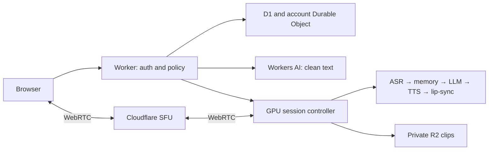

# One stack, two inference routes

Proposed architecture, not an implemented service. Exact models: [register](../research/MODELS.md).

| Job | Choice |
|---|---|
| Web/API | TypeScript, React/Vite assets and paid Cloudflare Workers |
| Accounts/chat/memory | D1, with account ownership on every private row |
| Live session/meter | Durable Object per account; durable event/ledger records in D1 |
| Portraits/clips | Private R2; authenticated delivery including range requests |
| Media | Cloudflare Realtime SFU + TURN between browser and GPU |
| Clean free text | Workers AI Qwen3-30B-A3B-FP8 and Llama Guard checks |
| Paid calls/adult inference | Conditional TensorDock dedicated 48GB Linux GPU VM |
| Commerce/age/email | CCBill hosted checkout, Yoti hosted verification, Resend |

Cloudflare's captured hosted catalog has no video-generation output model. AI Gateway models remain external providers. Decoding, lip-sync and encoding run on the GPU, not a Worker.

## Continuous call, bounded generation

Prepare owned fictional character loops once: listening, neutral speech, smile, thought. Cache face crops/latents. The loop supplies continuity while streamed speech drives fresh mouth animation. This is an engineering composition to test, not a world-first invention claim.

One admitted call on one L40S-class 48GB VM: Qwen3-8B quantized from official weights, faster-whisper/Whisper small, Kokoro, MuseTalk 1.5, H.264/Opus encoder. Memory fit and shared-GPU contention are unmeasured. Clip jobs use separate on-demand workers.

Endpoint speech, finalize transcription, retrieve ≤8 approved facts, assemble a ≤4,096-token prompt, stream a short non-thinking reply, synthesize clauses, animate and transmit timestamped media. Target allocation: 250ms endpointing + 150ms ASR + 300ms first text + 200ms first speech + 200ms rendering + 200ms network = 1.3s. This is a budget, not an SLA; measure the end-to-end tail.

Every response has a generation ID. Interruption cancels its text/audio/frames; stale generations cannot play after reconnect. Safety checks gate clauses before playback. Use audio as the synchronization clock, bounded jitter buffers and at most one speculative clause. No user-camera processing in this version.

Talking videos reuse the renderer offline. Wan cinematic clips are asynchronous jobs with input/output checks, deadlines, maximum cost and entitlement restoration on failure. Identity may drift; inspect before delivery. Output at 24fps does not imply generation at 24fps.

## State and isolation

Minimum tables: accounts, companions, messages, approved_memories, subscriptions, purchase_intents, payment_events, allowance_ledger, call_sessions, media_jobs. Authenticate and scope every query; opaque IDs are not authorization.

The account Durable Object serializes reservations/debits. Persist idempotency keys and settlement entries; reconcile D1 after interrupted writes. Reserve small blocks, settle connected seconds and release unused time. Pause pilot metering on degradation. Never use KV or browser counters as balance authority.

Bound history plus approved facts replaces vector search initially. Separate clean/adult histories. Adult text, transcripts, summaries and embeddings never fall back to a clean-only provider. Server-selected eligibility/policy routes fail closed. GPU access uses short-lived session grants; management keys stay server-side.

Adult text uses a separately metered Qwen3-8B text worker during advertised beta hours, with bounded queue/batching. Its allocated load/idle/safety compute must fit the per-exchange assumption in economics; it is not a free byproduct of the call worker. Outside those hours, adult service is unavailable. Users may deliberately start a separate clean conversation; existing adult content is never forwarded. Local text policy checks use Qwen3-8B in a separate classification pass, benchmarked with the rest of the workload. Initially review every generated clip before delivery.
